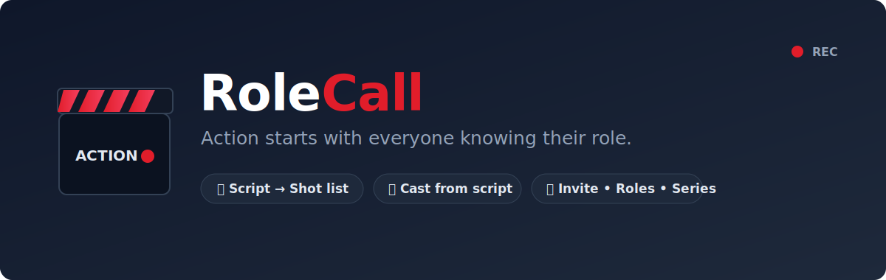
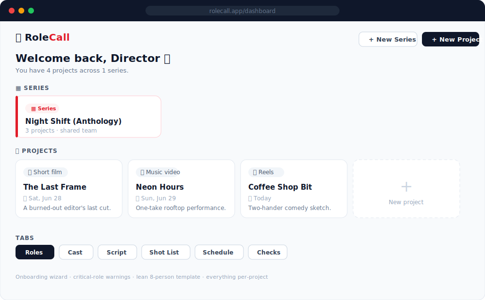
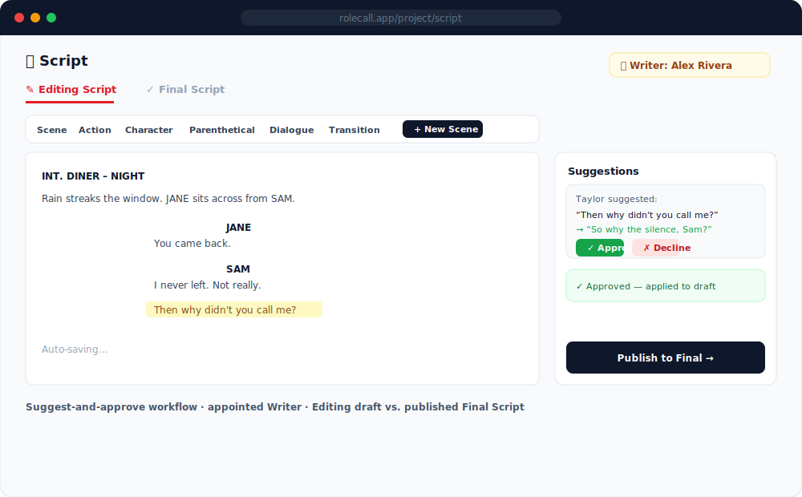
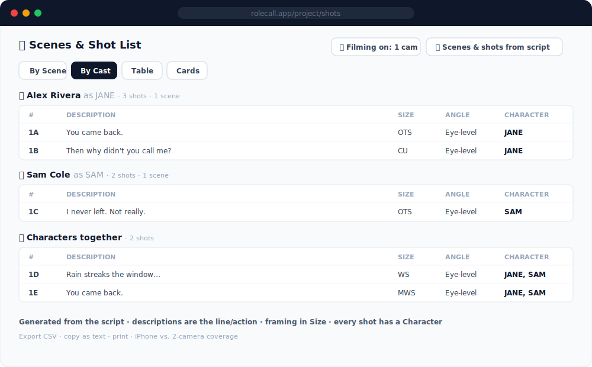
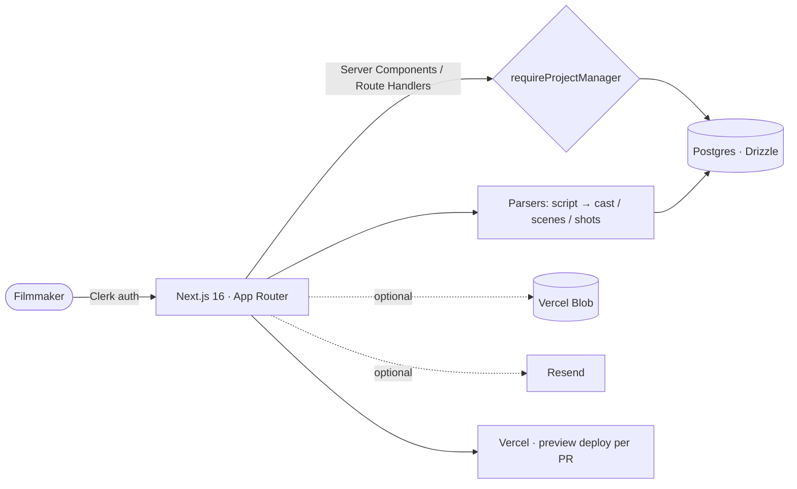

<div align="center">



# 🎬 RoleCall

**The all-in-one production hub for filmmakers.** One person creates a project,
pastes a screenplay, and RoleCall turns it into a **cast list and a
camera-ready shot list automatically** — then the whole crew joins by link to
plan roles, script, and schedule, so when you call _"Action!"_ nothing falls
through the cracks.

[](https://role-call-taylordrew4u2s-projects.vercel.app)
&nbsp;
[](https://nextjs.org/)
[](https://www.typescriptlang.org/)
[](https://tailwindcss.com/)
[](https://vercel.com/)

</div>

---

## 📸 Demo

> **[▶ Open the live app](https://role-call-taylordrew4u2s-projects.vercel.app)** — sign in and create a project in under a minute. Fully responsive — built to live in your hand on set.

|  |  |
|---|---|
| **Dashboard** — projects & series at a glance | **Script** — suggest → approve → publish |
|  |  |

**Shot list — generated from the script and organized by cast**



> _UI previews above. Live, signed-in screens are on the [demo](https://role-call-taylordrew4u2s-projects.vercel.app)._

---

## 💡 The problem & the solution

**The problem.** Indie and student film shoots run on a mess of group chats,
Google Sheets, and a script PDF nobody's synced on. Who's playing whom, which
roles are unfilled, what to shoot, and who's needed each day all live in
different places — and break on set day.

**The users.** Solo TikTok/Reels creators shooting on a phone, film-school crews
running two cameras, and short/feature directors who need a real call sheet.

**The solution.** RoleCall is one source of truth from script to shoot day. Its
standout move: you **paste a screenplay and it does the tedious prep for you** —
extracts the cast, breaks the script into scenes, and builds a cast-tagged shot
list whose coverage matches whether you're shooting on one camera or two. No
spreadsheets, no per-seat accounts (everyone joins by link), and — unlike tools
that bolt on an LLM — **no AI cost**, because the script intelligence is pure
parsing.

---

## 🧰 Tech stack

**Frontend**
- **Next.js 16** (App Router, React Server Components) + **TypeScript** — server-rendered data with minimal client JS.
- **Tailwind CSS v4** + a custom **shadcn-style** component system — fast, consistent UI without a heavy library.
- **Lucide** icons.

**Backend & data**
- **Vercel Postgres (Neon)** + **Drizzle ORM** — typed schema and queries; runtime-idempotent DDL for zero-friction migrations.
- **Next.js Route Handlers** for the API, behind a single project-access guard.

**Auth, storage, email**
- **Clerk v7** — drop-in auth + linked invite acceptance.
- **Vercel Blob** _(optional)_ — script file uploads. **Resend** _(optional)_ — invite emails. Both degrade gracefully when unconfigured.

**Tooling & delivery**
- **Vercel** with a **preview deploy per PR**, ESLint, and `tsc` type-checking.

---

## ✨ Key features

- **🎭 Cast from script** — auto-detects every speaking character (handles
  `(V.O.)`/`(CONT'D)`, `NAME:` and title-case cues, and scripts with no slug
  lines); you assign who plays each role.
- **🎥 Shot list from script** — generates scenes + shots (action, full
  **dialogue coverage**, or both) with **zero AI cost**. Descriptions read like
  the script; framing lives in the Size/Angle columns; **every shot is tagged
  with its character**.
- **📱 Camera-aware coverage** — **iPhone / 1 camera** (one person per shot) vs.
  **2 cameras** (adds two-shots); the By-Cast view gains a "Characters
  together" section.
- **✍️ Script workspace** — Editing draft + published **Final Script**, a
  screenwriting toolbar, and a **suggest-and-approve** flow with an appointed
  **Writer**.
- **🎟️ Smart invites** — name-only invites with a copyable link (no account or
  email required); invite **as Writer or Director**, where a Director gets
  **full owner-level powers**.
- **👥 Side-by-side team view** — Cast and Collaborators displayed in parallel
  columns; permission pills inline. Only crew (not actors) appear in the Role
  Assignment board — cast is its own role type.
- **🎬 Roles & crew** — onboarding wizard, Role Assignment Board with
  critical-role warnings, one-click **lean 8-person template**.
- **🎞️ Series** — one team across many projects, via automatic fan-out.
- **🗓️ Schedule + exports** — shoot days with call times; **CSV** export, copy
  as text, print; **fully responsive**.

---

## 🚀 Installation & local setup

**Prerequisites:** Node 18+, npm, a free **Clerk** app, and a **Postgres** URL (Neon/Vercel).

```bash
# 1. Clone & install
git clone https://github.com/taylordrew4u2/Role-Call.git
cd Role-Call
npm install

# 2. Configure environment
cp .env.example .env.local      # fill in the values below

# 3. Run the dev server
npm run dev                     # http://localhost:3000

# 4. Create tables + seed roles (once; safe to re-run)
#    open http://localhost:3000/api/setup
```

```bash
# Quality gates
npm run lint                    # ESLint
npx tsc --noEmit                # type-check
npm run build                   # production build
```

| Variable | Required | Purpose |
|---|---|---|
| `NEXT_PUBLIC_CLERK_PUBLISHABLE_KEY` · `CLERK_SECRET_KEY` | ✅ | Auth (clerk.com) |
| `POSTGRES_URL` | ✅ | Database (Neon/Vercel) |
| `RESEND_API_KEY` | — | Invite emails |
| `BLOB_READ_WRITE_TOKEN` | — | Script file uploads |
| `NEXT_PUBLIC_APP_URL` | — | Site URL (falls back to `VERCEL_URL`) |

**Deploy to Vercel:** import the repo, add the **Neon** and **Clerk** marketplace
integrations (both free, keys auto-injected), redeploy, then open `/api/setup`
once. _No third-party billing required._

---

## 🎯 Usage

1. **Create a project** — the wizard recommends crew for what you're making.
2. **Add the script** — type/paste in the Script tab (autosaves).
3. **Generate the cast** — one click pulls every character from the script.
4. **Generate the shot list** — pick camera setup + coverage; RoleCall builds
   scenes + shots, each tagged with who's in it.
5. **Invite the team** — share copyable links; assign roles; set shoot days.
6. **On set** — open it on your phone, work the **By Cast** view, export/print.

---

## 🧠 Challenges & learnings

I designed and built **RoleCall end to end** — data model, API, and UI.

- **Turning a screenplay into a plan, for free.** Instead of an LLM, I wrote
  resilient parsers (`lib/parse-characters`, `lib/parse-scenes`,
  `lib/script-to-shots`) that survive real-world formatting — `(V.O.)` tags,
  `NAME:`/title-case cues, transitions, and Zoom-style scripts with no slug
  lines — and produce proper coverage (master → OTS → CU). The hard part was
  the long-tail of formats; I iterated the heuristics against messy samples and
  added a chunking pass so a long single-location conversation still gets
  coverage across the **whole** script instead of collapsing to a few shots.
- **Coverage that matches the rig.** A "Filming on" setting drives
  one-person-per-shot (single camera) vs. two-shots (two cameras), and the shot
  list reorganizes by character — a small product decision that makes the output
  actually usable on a real shoot.
- **Zero-downtime schema evolution.** Rather than a brittle migration step, new
  columns/tables apply **idempotently at runtime** (`ADD COLUMN IF NOT EXISTS`),
  so features reach existing data instantly — plus backfill tools to populate
  new fields on old records.
- **Trust boundaries.** A single `requireProjectManager` guard (owner _or_
  director) backs every mutating endpoint, and **Series** membership fans out
  into per-project rows so every existing feature works unchanged.
- **Accessibility first.** Every interactive element carries `aria-label` or
  `aria-pressed`; destructive actions use Radix `Dialog` modals instead of
  browser `confirm()`/`prompt()`; decorative icons are `aria-hidden`. The
  screenplay textarea exposes `aria-readonly` to screen readers.

---

## 🏗️ Architecture & key decisions



**Decisions & trade-offs**

- **Server Components first.** Data-heavy pages render on the server and pass
  minimal props to small client islands (e.g. the shot-list board), keeping
  client JS lean.
- **Local parsing over an LLM.** Deterministic, instant, free, and testable —
  the trade-off is hand-tuned heuristics instead of model "understanding,"
  which suits structured screenplay text well.
- **Runtime idempotent DDL over a migration gate.** Optimizes for shipping speed
  on a serverless host; the cost is doing a cheap `IF NOT EXISTS` check on first
  use, cached per process.
- **Fan-out membership for Series.** Series members are projected into
  `project_members`, so roles, cast, invites, and assignments reuse all existing
  per-project machinery with no special-casing.

---

## 🔭 Future improvements

- Real screenshots/Loom walkthrough in the demo section.
- Drag-to-reorder shots and shoot-day scheduling board.
- PDF call-sheet export per shoot day.
- Import `.fdx`/Fountain and richer scene/character analytics.
- Automated tests around the parsers (the highest-value unit-test target).

---

## 📂 Project structure

```
app/            Next.js routes (dashboard, project tabs, API route handlers)
components/     UI — ShotListBoard, ScriptWorkspace, RoleAssignmentBoard, …
lib/            parsers (script→cast/scenes/shots), access guards, Drizzle schema,
                member-positions (shared crew-position util used across components)
docs/           screenshots & brand assets
```

## 📜 License & links

- **License:** [MIT](LICENSE)
- **Live demo:** https://role-call-taylordrew4u2s-projects.vercel.app
- **Repository:** https://github.com/taylordrew4u2/Role-Call

<div align="center">

🎬 **RoleCall** — _every role, every shot, every day. Called._

</div>
